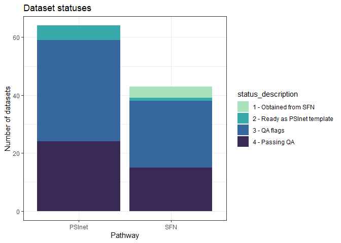

README
================
Renata
2024-03-21

This repo houses scripts for QA of PSInet data.

## Current status

<!-- -->

| source | status_description           |   n |
|:-------|:-----------------------------|----:|
| PSInet | 2 - Ready as PSInet template |  62 |
| PSInet | 4 - Passing QA               |   2 |
| SFN    | 2 - Ready as PSInet template |  39 |

# Data QA instructions

TO BE UPDATED
